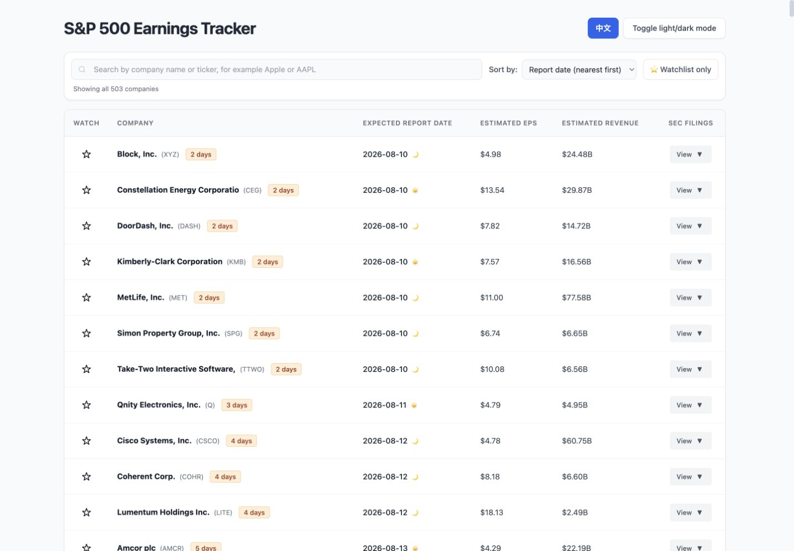

# 📈 S&P 500 Earnings Tracker

This personal project tracks expected earnings dates, BMO/AMC timing, and recent SEC 10-Q and 10-K filings for companies in the S&P 500.

**Live site:** [ianhoutsai-afk.github.io/earnings-tracker](https://ianhoutsai-afk.github.io/earnings-tracker/)

## Project Motivation

I independently defined the product requirements for this personal project and used AI-assisted development to help implement and review parts of the code. I personally test the workflows, validate the output, and maintain the project as its requirements and data sources evolve.

這是由我自行定義需求的個人項目。我使用 AI 輔助部分程式實作與審查，並親自測試工作流程、核對輸出及持續維護項目。

---

## English

### Features

- **S&P 500 coverage:** Uses a cached constituent mapping and tracks roughly 500 companies.
- **Earnings schedule:** Displays expected report dates and BMO/AMC timing when the source data provides it.
- **SEC filing history:** Links recent matched 10-Q and 10-K filings and labels filings using each company's fiscal calendar.
- **Local watchlist:** Stores selected tickers in the browser with `localStorage` and supports watchlist-only filtering.
- **Search and sorting:** Filters by company name or ticker and sorts by report-date countdown or ticker.
- **Bilingual interface:** Opens in English by default and can switch to Traditional Chinese. The selected language is retained in the browser.
- **Display controls:** Includes light/dark themes and a horizontally scrollable table for smaller screens.
- **Chinese Bark notifications:** Sends a Traditional Chinese morning summary of companies expected to report that day, grouped by BMO, AMC, or unconfirmed timing.

### Deployment

1. Select **`Use this template`** → **`Create a new repository`** and create a public repository.
2. Open **`Settings`** → **`Actions`** → **`General`** → **`Workflow permissions`**, select **`Read and write permissions`**, and save.
3. Open **`Settings`** → **`Pages`**, choose the `main` branch as the source, and save.
4. To enable Bark notifications:
   - Install Bark on an iPhone and copy the personal Bark key.
   - Open **`Settings`** → **`Secrets and variables`** → **`Actions`**.
   - Add `BARK_KEY` as a repository secret.
   - Run **`Bark Earnings Notification`** manually with `test_notification` enabled to verify delivery.

Production Bark notifications include every tracked company reporting that day and remain in Traditional Chinese. A day with no scheduled reports still sends a `0 companies` status.

### Controlled SEC Proxy and Fair Access

Direct SEC requests from some cloud-hosted environments may be unavailable or unreliable. `proxy-worker.js` can be deployed as a controlled Cloudflare Worker relay for authorized requests from this repository. It is not intended to evade SEC access controls and does not exempt an operator from the SEC's rules.

The deployment must follow the current [SEC Fair Access requirements](https://www.sec.gov/about/developer-resources): use efficient scripts, request only the data needed, identify automated traffic, and keep aggregate traffic within the SEC's published request-rate limit. At the time of this README revision, the SEC publishes a limit of no more than 10 requests per second in total, regardless of the number of machines used.

1. Create a Cloudflare Worker and paste in `proxy-worker.js`.
2. Add an encrypted Worker secret named `PROXY_TOKEN`. Generate a random value, for example with `openssl rand -hex 32`, and never commit the value.
3. Add `SEC_CONTACT_EMAIL` with a monitored contact address used by the SEC request `User-Agent`.
4. Deploy the Worker and record its URL.
5. Add matching GitHub Actions secrets:
   - `PROXY_TOKEN`: the same token stored by the Worker.
   - `SEC_PROXY_URL`: the deployed Worker URL.
   - `SEC_CONTACT_EMAIL`: the monitored contact address.
6. Run **`Earnings Tracker Update`** manually, confirm the controlled proxy works, and retire any previous token.

The Worker returns HTTP 503 when `PROXY_TOKEN` is not configured and HTTP 401 when the request token is missing or does not match. Local runs can call the SEC directly with `SEC_CONTACT_EMAIL` configured and do not require the Worker.

### Bark Scheduling Worker

GitHub scheduled workflows can be delayed. `bark-scheduler-worker.mjs` is an optional Cloudflare Worker that dispatches the lightweight Bark workflow close to 09:00 in `Asia/Shanghai`:

1. Create a fine-grained GitHub personal access token restricted to this repository with **Actions: Read and write** permission.
2. Create a separate Cloudflare Worker and paste in `bark-scheduler-worker.mjs`.
3. Add the token as an encrypted Worker secret named `GITHUB_ACTIONS_TOKEN`.
4. Add a Cron Trigger using `0 1 * * *`; Cloudflare cron uses UTC.
5. Deploy the Worker and use Cloudflare's scheduled-event test to confirm that **`Bark Earnings Notification`** starts on GitHub.

The scheduler Worker has no public HTTP handler and does not receive the Bark key. `BARK_KEY` remains stored in GitHub Actions.

### Technical Overview

- **Data update:** Python 3.9, `yfinance`, and `requests` with retry handling.
- **Frontend:** Tailwind CSS, browser ES modules, Vanilla JavaScript, and `localStorage`.
- **Automation and hosting:** GitHub Actions and GitHub Pages.
- **Optional workers:** Separate Cloudflare Workers for controlled SEC requests and Bark workflow scheduling.

---

## 中文

### 功能

- **S&P 500 成分股範圍：** 使用快取的成分股映射，追蹤約 500 家公司。
- **財報時間表：** 顯示預計發布日期；資料來源提供時間資訊時，標示盤前或盤後。
- **SEC 申報紀錄：** 連結配對後的近期 10-Q 與 10-K 文件，並依各公司財年標示季度。
- **本機收藏清單：** 使用瀏覽器 `localStorage` 保存關注股票，並支援只顯示收藏項目。
- **搜尋與排序：** 可按公司名稱或股票代碼搜尋，並按發布日倒數或股票代碼排序。
- **中英文介面：** 首次開啟預設為英文，可切換至繁體中文；瀏覽器會保留語言選擇。
- **顯示設定：** 提供日／夜模式；較小螢幕可橫向捲動表格。
- **中文 Bark 通知：** 每日早上以繁體中文推送當天預計發布財報的公司，並依盤前、盤後及時間待確認分組。

### 部署

1. 點擊 **`Use this template`** → **`Create a new repository`**，建立公開倉庫。
2. 前往 **`Settings`** → **`Actions`** → **`General`** → **`Workflow permissions`**，選擇 **`Read and write permissions`** 並儲存。
3. 前往 **`Settings`** → **`Pages`**，選擇 `main` 分支作為來源並儲存。
4. 如需啟用 Bark 通知：
   - 在 iPhone 安裝 Bark 並複製個人 Bark Key。
   - 前往 **`Settings`** → **`Secrets and variables`** → **`Actions`**。
   - 新增 Repository Secret：`BARK_KEY`。
   - 手動執行 **`Bark Earnings Notification`**，保持 `test_notification` 啟用以驗證推送。

正式 Bark 通知維持繁體中文，涵蓋所有當日預計發布財報的追蹤公司；沒有財報時仍會推送「今日 0 家」。

### 受控 SEC 代理與 Fair Access

部分雲端環境可能無法穩定直接連線 SEC。`proxy-worker.js` 可部署為受控 Cloudflare Worker 代理，只接受本倉庫經授權的請求。本項目在需要時使用受控代理，並遵守 SEC Fair Access 要求；此代理不是用來規避 SEC 存取控制。

部署時必須遵守 SEC 最新的 [Developer Resources and Fair Access 指引](https://www.sec.gov/about/developer-resources)：使用有效率的程式、只請求所需資料、識別自動化流量，並讓所有機器的合計流量維持在 SEC 公布的限制內。本 README 修訂時，SEC 公布的上限為合計每秒不超過 10 個請求。

1. 建立 Cloudflare Worker，貼上 `proxy-worker.js`。
2. 新增加密 Worker Secret `PROXY_TOKEN`。可用 `openssl rand -hex 32` 產生隨機值，且不得提交至 Git。
3. 新增 `SEC_CONTACT_EMAIL`，填入有人監看的聯絡信箱，供 SEC 請求的 `User-Agent` 使用。
4. 部署 Worker 並記下網址。
5. 在 GitHub Actions 新增相符的 Secrets：
   - `PROXY_TOKEN`：與 Worker 相同的 Token。
   - `SEC_PROXY_URL`：部署後的 Worker 網址。
   - `SEC_CONTACT_EMAIL`：有人監看的聯絡信箱。
6. 手動執行 **`Earnings Tracker Update`**，確認受控代理可用，並停用任何舊 Token。

Worker 未設定 `PROXY_TOKEN` 時會回傳 HTTP 503；請求未提供相符 Token 時會回傳 HTTP 401。本機執行可在設定 `SEC_CONTACT_EMAIL` 後直接連線 SEC，不需要 Worker。

### Bark 排程 Worker

GitHub 定時 workflow 可能延遲。選用的 `bark-scheduler-worker.mjs` 會在接近 `Asia/Shanghai` 09:00 時觸發 Bark workflow：

1. 建立只限本倉庫、具有 **Actions: Read and write** 權限的 fine-grained GitHub personal access token。
2. 在 Cloudflare 建立另一個 Worker，貼上 `bark-scheduler-worker.mjs`。
3. 新增加密 Worker Secret `GITHUB_ACTIONS_TOKEN`。
4. 新增 Cron Trigger `0 1 * * *`；Cloudflare cron 使用 UTC。
5. 部署後使用 Cloudflare scheduled event 測試，確認 GitHub 出現新的 **`Bark Earnings Notification`** 執行紀錄。

Scheduler Worker 沒有公開 HTTP handler，也不接收 Bark Key；`BARK_KEY` 只保留在 GitHub Actions Secrets。

### 技術概覽

- **資料更新：** Python 3.9、`yfinance`、`requests` 與重試處理。
- **前端：** Tailwind CSS、瀏覽器 ES Modules、原生 JavaScript 與 `localStorage`。
- **自動化與託管：** GitHub Actions 與 GitHub Pages。
- **選用 Worker：** 受控 SEC 請求與 Bark workflow 排程分別使用獨立的 Cloudflare Worker。

### 維護

S&P 500 成分股有變動時，可在 **Actions** 頁面手動執行 **`Build S&P 500 Cache`**，透過 DataHub 更新快取。

### 免責聲明

本工具僅供資訊參考。財務資料來自 Yahoo Finance 與 SEC 等公開來源，可能有延遲、缺漏或錯誤。投資決策應以公司公告及 SEC 官方申報文件為準。
